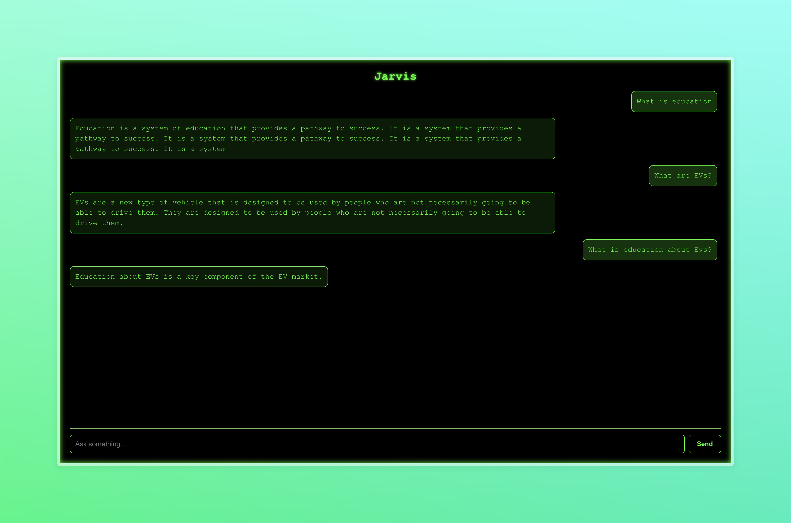

# Jarvis Vector Chat

A full-stack AI chatbot system that integrates a custom vector database with modern retrieval-augmented generation (RAG) capabilities. This project demonstrates an end-to-end RAG pipeline using a Node.js backend, a Python-based vector database, and a responsive React frontend.
This system allows users to interact with an intelligent assistant that can answer questions based on a set of documents, leveraging vector embeddings for efficient similarity search.

---


## Demo
[](https://www.youtube.com/watch?v=_gkILq7J7Bk)


### Chat Application
- Responsive UI built with React
- Real-time interactions with an intelligent assistant
- Fully functional on both desktop and mobile devices

### Backend
- Express-based Node.js server
- Handles embedding, vector search, and response generation
- Clean modular structure with API routes:
  - `/insert`: Accepts new documents and embeds them
  - `/search`: Performs top-k dot product similarity search
  - `/query`: RAG-based query answering
### API Overview

#### Endpoints

| Endpoint   | Method | Description                                 |
|------------|--------|---------------------------------------------|
| `/insert`  | POST   | Insert documents and store embeddings       |
| `/search`  | POST   | Perform vector search on inserted documents |
| `/query`   | POST   | Full RAG flow: embed → search → generate    |

---

#### Request Headers

All API requests must include the following headers:

```http
x-api-key: <Secret API Key>
Content-Type: application/json
```

### Vector Database
- Simple Python implementation with flat index
- Embeddings stored in-memory or on disk (JSON)
- Supports single and batch insertions
- Efficient top-k dot product similarity search
